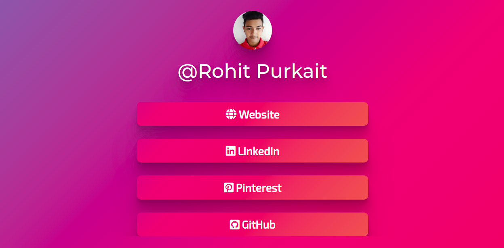

# LinkFree

A free and open source alternative to LinkTree!

[Website](https://michaelbarney.github.io/LinkFree)

## What is LinkFree?

Ever wanted to add more links to your Instagram bio? LinkFree does just that! It gathers all of your links into one page that is easy to navigate.

## What are the benefits?

Compared to other solutions, LinkFree is fully customizable and open source!

- No more pesky third party logos
- Add your custom colors, images and fonts
- Use full custom analytics and metrics platforms
- Create your own template or use one made by the community!

## How to use?

To startoff, you can choose a template for your LinkFree in the "Templates" directory. Then you can clone or fork this repository to adapt it with your information.

You can fork this repository to your own account and there configure your personal page using github pages. This will let you make edits much faster.

## How to see statistics?

You can use any statiscs platform of your choosing that is based on client javascript. We recommend the following:

- [Amplitude](https://amplitude.com/homepage)
- [Hotjar](https://www.hotjar.com/)

You can use any of the functions for load and click defined on the javascript file of the LinkFree template or add code snippets to the Head or Body of the HTML file.

## How to contribute?

There are a three ways you can contribute. You can make changes to the core LinkFree project, create new LinkFree templates or just share your LinkFree.

### Creating Templates

A new template is a general LinkFree that has a distinctive structure or style when compared to previous templates.

To submit one, you just have to make a pull request with your addition in the "Templates" directory.

## Some Existing Templates

| Name           |  Desktop Screenshot                                                                                                                           |Mobile Screenshot                                                             | Contributed by                                     |
| -------------- | --------------------------------------------------------------------------------------------------------------------------------------------- |------------------------------------------------------------------------------|-------------------------------------------------- |
| Art Theme  |     |    |  [@RohitPurkait](https://github.com/codeswithroh) |
| 3d Theme  |    |   | Farell Faiz|
| Shades of Purple Theme  |    |    | [@RohitPurkait](https://github.com/codeswithroh)               