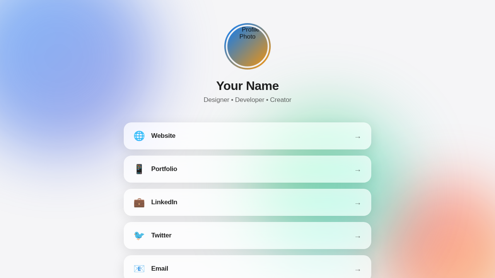

# Liquid Theme

A modern, Apple-inspired LinkFree theme featuring liquid animations, glassmorphism effects, and smooth interactions based on Apple's latest design trends.



## Demo
https://michaelbarney.github.io/LinkFree/Templates/Liquid/

## Features

- 🎨 **Apple-Inspired Design**: Clean, modern aesthetic following Apple's design language
- 💧 **Liquid Animations**: Smooth, floating gradient orbs that create a dynamic background
- 🌈 **Glassmorphism Effects**: Frosted glass-like cards with backdrop blur
- 🌓 **Dark Mode Support**: Automatically adapts to system preferences
- 📱 **Fully Responsive**: Optimized for all screen sizes
- ♿ **Accessible**: Includes focus states and reduced motion support
- ⚡ **Smooth Animations**: Beautiful transitions and hover effects

## How to Use

### index.html

1. **Title**
   Change the page title:
   ```html
   <title>Your Name - Links</title>
   ```

2. **Profile Image**
   Replace the image URL with your photo:
   ```html
   
   ```

3. **Name and Bio**
   Update your name and bio:
   ```html
   <h1 class="profile-name">Your Name</h1>
   <p class="profile-bio">Your Title • Your Role • Your Passion</p>
   ```

4. **Links**
   Customize your links by editing or adding link cards:
   ```html
   <a href="YOUR_LINK_URL" class="link-card" target="_blank">
       <span class="link-icon">🌐</span>
       <span class="link-text">Link Title</span>
       <span class="link-arrow">→</span>
   </a>
   ```

   You can use any emoji for the icon, or replace it with an icon library like Font Awesome.

### style.css

5. **Color Customization**
   Adjust the gradient colors in the CSS variables:
   ```css
   :root {
       --primary-gradient-start: #007AFF;
       --primary-gradient-end: #5856D6;
       --secondary-gradient-start: #FF2D55;
       --secondary-gradient-end: #FF9500;
       --tertiary-gradient-start: #30D158;
       --tertiary-gradient-end: #00C7BE;
   }
   ```

6. **Font Customization**
   The theme uses Inter font by default. You can change it:
   ```css
   --font-family: 'Your Font', -apple-system, BlinkMacSystemFont, sans-serif;
   ```

## Design Elements

### Glassmorphism
The link cards feature a frosted glass effect using `backdrop-filter` with blur and saturation adjustments.

### Liquid Animations
Three gradient orbs float around the background with smooth, organic movements inspired by Apple's fluid interfaces.

### Smooth Interactions
All interactive elements include carefully crafted transitions using Apple's preferred cubic-bezier timing function.

### Responsive Breakpoints
- Desktop: 768px and above
- Tablet: 481px - 767px
- Mobile: 480px and below

## Browser Support

- Chrome/Edge (latest)
- Firefox (latest)
- Safari (latest)
- Opera (latest)

**Note**: Glassmorphism effects require modern browsers with backdrop-filter support.

## Credits

Created for LinkFree by following Apple's latest design trends including glassmorphism, liquid animations, and modern UI patterns.

## License

Free to use and modify for personal and commercial projects.
