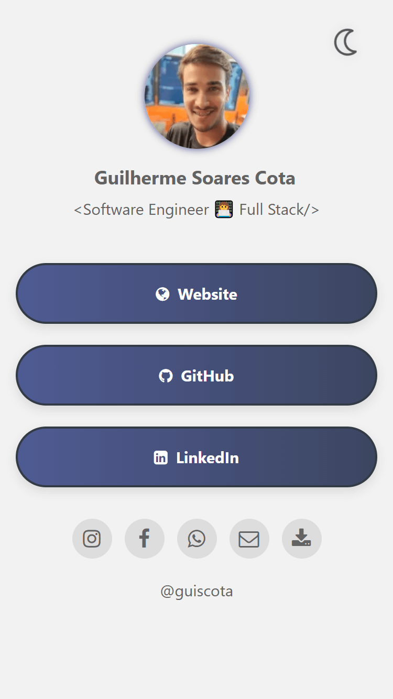
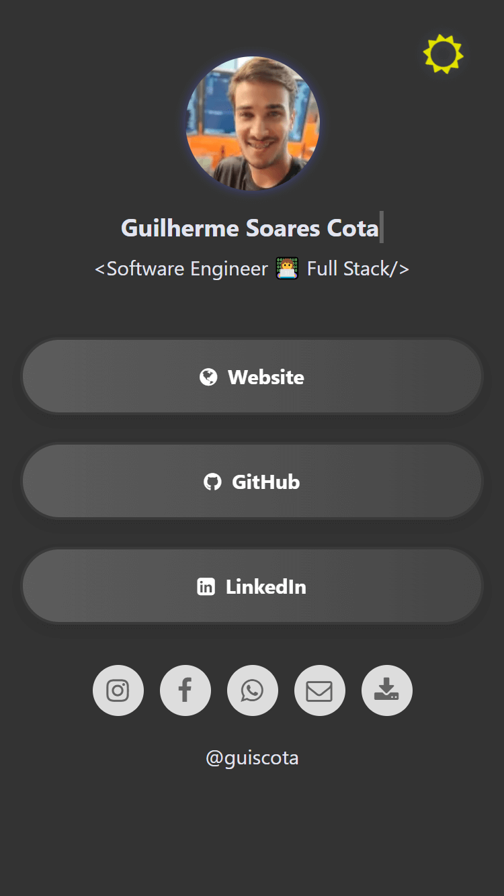
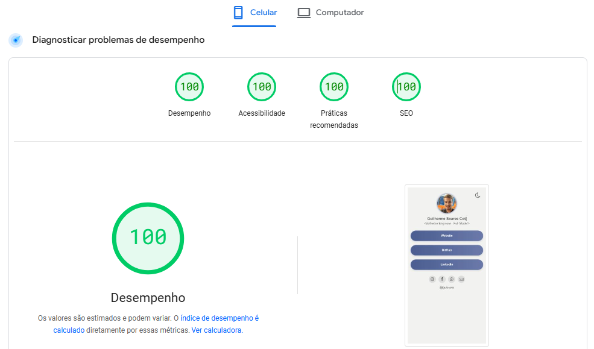
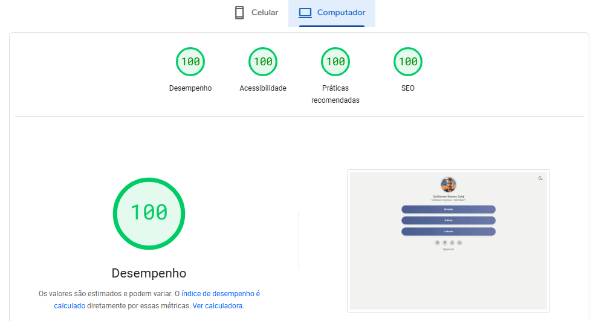

# **LinkFree - Página de Links Personalizada**

[](https://pagespeed.web.dev/analysis/https-links-guiscota-dev/hhosx8e8ii?form_factor=mobile)

### **Descrição**

Essa é uma página de links dinâmica e personalizável, construída com foco em alta performance e na experiência do usuário, ideal para quem deseja centralizar suas redes sociais e links importantes de maneira elegante e eficiente.

Com uma interface responsiva e suporte a temas claro e escuro, a página se adapta ao estilo de cada usuário.

<p align="center">
  
  
</p>

---

## **Funcionalidades Principais**

- **Carregamento Rápido**: Arquitetura leve, garantindo tempos de resposta rápidos.
- **Tema Dinâmico para o usuário final**: Alternância entre modo claro e escuro com um clique.
- **Informações, Links, Cores e Botões Customizáveis**: Adicione seus dados, modifique e personalize seus links, cores e botões de maneira fácil, a partir de um único arquivo JSON.
- **Ícones Personalizáveis**: Suporte a diversos ícones estilizados da plataforma [Font Awesome 4](https://fontawesome.com/v4/icons/).
- **Totalmente Responsivo**: Funciona perfeitamente em qualquer dispositivo, seja desktop, tablet ou celular.
- **Animação de Texto e elementos**: Nome animado com efeito de digitação opcional e animação nos botões.

---

## **Demonstração de Performance**

A página atinge a pontuação máxima de **100/100** no Google PageSpeed Insights, garantindo uma navegação rápida e eficiente, mesmo em redes de baixa velocidade. Isso significa que os visitantes terão uma experiência ágil e otimizada, sem comprometer o design ou funcionalidades.

Este projeto é desenvolvido seguindo as melhores práticas de SEO e performance:

- **SEO Otimizado**: As tags `meta` para descrição e palavras-chave são incluídas dinamicamente de acordo com o que foi informado no arquivo de configurações.
- **Carga Assíncrona**: Todos os dados são carregados de forma assíncrona para otimizar o tempo de carregamento.
- **Compressão e Minificação**: Os arquivos são minificados para reduzir o tamanho de transferência.




---

## **Personalização**

Edite o arquivo [`./assets/db/data.json`](./assets/db/data.json) para adicionar ou remover seus links, além de alterar suas informações e cores desejadas.

```json
{
    "settings": {
        "favicon": "link para favicon",
        "pageDescription": "Descrição da página",
        "pageKeywords": "Palavras chave",
        "bottons": {
            "linksBorderRadius": "30px",
            "socialMediaBorderRadius": "50%"
        },
        "colors": {
            "background": "#f3f2f2",
            "primary": "#4F5B93",
            "secondary": "#333b47",
            "linkText": "#fff",
            "socialIconBackground": "#dddddd"
        }
    },
    "user": {
        "photo100px": "link para foto de pefil",
        "name": "Nome completo",
        "nameWritingAnimation": true,
        "bio": "Breve biografia",
        "username": "username"
    },
    "links": [
        {
            "text": "Website",
            "url": "https://yourwebsite.com",
            "classIcon": "fa fa-globe"
        }
    ],
    "socialMedias": [
        {
            "text": "Instagram",
            "url": "https://www.instagram.com/username",
            "classIcon": "fa fa-instagram"
        }
    ]
}
```

## **Usando o Rollup para Empacotar o Projeto**

O **Rollup** é um empacotador de módulos que permite agrupar o código do projeto, otimizando-o e minificando tanto arquivos JavaScript quanto CSS para melhorar o desempenho.

### **Configurando o Rollup**

O projeto já vem com uma configuração de Rollup preparada para empacotar o código JavaScript e minificar o CSS. O arquivo de configuração é o `rollup.config.js`, que define os pontos de entrada e saída, além dos plugins utilizados.

#### **Como Usar o Rollup no Projeto**

1. **Instalar as dependências**:
   
   Antes de iniciar o processo de empacotamento, certifique-se de ter o **Node.js** e o **npm** instalados. Em seguida, instale as dependências do projeto:

   ```bash
   npm install
   ```

2. **Rodar o Build**:
   
   Para gerar a versão otimizada do projeto, execute o seguinte comando:

   ```bash
   npx rollup -c
   ```

   Isso irá empacotar o código e gerar os arquivos minificados na pasta `dist`:

   - `dist/bundle.min.js`: Arquivo JavaScript minificado.
   - `dist/bundle.min.css`: Arquivo CSS minificado.

#### **Modificando o Código JavaScript e CSS**

Se você modificar os arquivos originais de código, como:

- **JavaScript**: `/assets/js/script.js`
- **CSS**: `/assets/css/style.css`

Será necessário rodar novamente o Rollup para que as mudanças sejam refletidas nos arquivos minificados. Sempre que fizer alterações, execute o comando abaixo para gerar os novos arquivos minificados:

```bash
npx rollup -c
```

#### **Referência aos Arquivos Minificados**

Na página principal, `index.html`, os arquivos JavaScript e CSS estão configurados para apontar para as versões minificadas geradas pelo Rollup. Ou seja, a página carrega diretamente:

- `/dist/bundle.min.js`: O JavaScript minificado.
- `/dist/bundle.min.css`: O CSS minificado.

Certifique-se de rodar o Rollup após qualquer mudança para garantir que a página utilize os arquivos minificados mais recentes.

