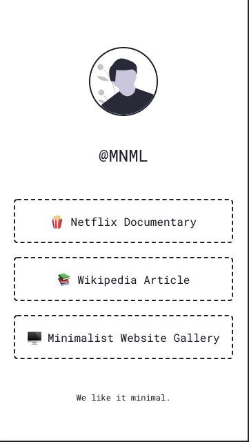
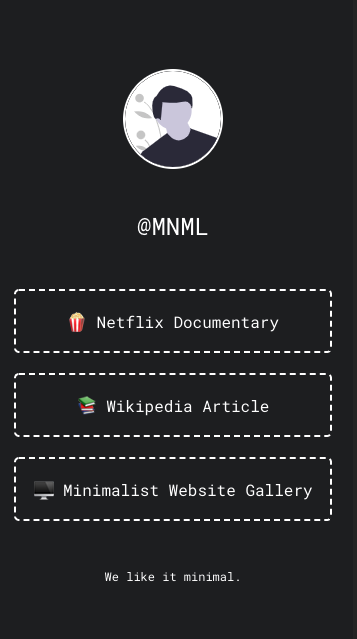

# MNMLSM

MNMLSM is a simple theme inspired by the command line. It has a darkmode and no javascript. In other words: it is future proof.

Preview Light             |  Preview Dark
:-------------------------:|:-------------------------:
 |   

The theme was created by [Ungeschneuer](https://github.com/ungeschneuer). A preview can be found [here](https://michaelbarney.github.io/LinkFree/Templates/mnmlsm/).

## Getting Started

You should probably change the following things:
- lang attribute for the html tag
- title in head tag
- favicon in asset folder
- userPhoto in asset folder
- userName
- links (duh!)
- footer content

## Add a new link

To add a new link, just duplicate an existing line between the links div or add a new one like this

```
<a class="link" href="#" target="_blank">#</a>
```


## Add Emojis

If you want to add emojis to your links, you can Copy/Paste them via [GetEmoji](https://getemoji.com/). For current Mac and Windows versions, there is also a system shortcut.

Mac:
```
Ctrl + Cmd + Space
```

Windows 
```
Windows + ; (semi-colon) 
``` 
or
```
Windows + . (period)
```


## Sources

The Avatar in the preview is by [unDraw](https://undraw.co/).